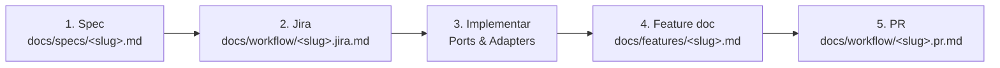

# Spec-Driven Development — guia completo

Este guia explica **como criar uma nova funcionalidade** neste monorepo seguindo spec-driven development (SDD): a solução é especificada e validada **antes** de qualquer código ser escrito, e essa spec vira a fonte da verdade para Jira, implementação, documentação e PR.

## Por que spec-driven?

Sem uma spec, o alinhamento sobre "o que construir" acontece implicitamente durante a implementação ou, pior, só na revisão do PR — quando mudar de rumo já é caro. Com spec-driven:

- **Alinhamento acontece antes do código**, quando ainda é barato mudar de ideia.
- A spec vira **checklist de aceite** — dá pra saber quando a feature está pronta.
- Jira, feature doc e PR deixam de ser redigidos "do zero" e passam a **referenciar** a spec, evitando retrabalho e divergência entre os documentos.
- **TDD é obrigatório**: os critérios de aceite da spec viram testes primeiro (Red), a implementação só os faz passar (Green), e então refatora (Refactor). Nada é implementado sem um teste falhando primeiro.

## Visão geral do fluxo



Todos os arquivos de uma mesma feature compartilham o **mesmo `<slug>`** em kebab-case (ex: `add-filters`), o que permite navegar entre spec → Jira → feature → PR sem ambiguidade.

| Etapa | Pasta | Arquivo | Template |
|-------|-------|---------|----------|
| 1. Spec | `docs/specs/` | `<slug>.md` | [`_template.md`](./specs/_template.md) |
| 2. Jira | `docs/workflow/` | `<slug>.jira.md` | [`_template-jira.md`](./workflow/_template-jira.md) |
| 3. Implementação com TDD | código | Red-Green-Refactor | `.cursor/rules/architecture/runes-ports-adapters.mdc` + TDD |
| 4. Feature doc | `docs/features/` | `<slug>.md` | [`_template.md`](./features/_template.md) |
| 5. PR | `docs/workflow/` | `<slug>.pr.md` | [`_template-pr.md`](./workflow/_template-pr.md) |

## Passo a passo

### 1. Escrever a spec (`docs/specs/<slug>.md`)

Copie [`docs/specs/_template.md`](./specs/_template.md) para `docs/specs/<slug>.md` e preencha, de preferência em conversa com quem vai revisar (o time, o PO, ou você mesmo pensando em voz alta):

- **Contexto** — qual problema existe hoje e por que essa funcionalidade é necessária.
- **Objetivo** — o que deve existir ao final, em 1–2 frases.
- **Escopo** — o que está incluído e o que está explicitamente fora.
- **Requisitos funcionais** — o que o sistema deve fazer (RF1, RF2, ...).
- **Requisitos não funcionais** — performance, acessibilidade, testes, se aplicável.
- **Critérios de aceite** — no formato `Dado ..., quando ..., então ...`; isso vira a base dos testes e do checklist do Jira.
- **Design (Ports & Adapters)** — quais camadas mudam: domínio (`packages/todo-domain`), gateway, server, API, UI. Não precisa ser exaustivo, mas precisa dar pra visualizar o caminho `UI → Container → Gateway → API → Store → Domínio`.
- **Contrato de API** — método, rota, request/response, se a feature expõe ou consome endpoints.
- **Alternativas consideradas** — trade-offs entre abordagens, se houver mais de um jeito razoável de resolver.
- **Questões em aberto** — dúvidas que ainda precisam de decisão antes de implementar.

**Valide a spec antes de prosseguir.** O objetivo é discutir e ajustar o desenho enquanto ainda é só texto. Só depois de a spec fazer sentido é que vale abrir o Jira.

Atualize o índice em [`docs/specs/README.md`](./specs/README.md).

### 2. Abrir o Jira (`docs/workflow/<slug>.jira.md`)

Copie [`_template-jira.md`](./workflow/_template-jira.md) para `docs/workflow/<slug>.jira.md`. A spec já define os critérios de aceite e o desenho técnico — o Jira reaproveita isso, adicionando metadados de gestão (tipo, prioridade, story points, labels). No campo **Links**, referencie `docs/specs/<slug>.md`.

Sem credenciais de Jira integradas, este arquivo é um rascunho pronto para colar na ferramenta real. Nunca invente uma Jira Key — deixe o placeholder `[JIRA-KEY]`.

### 3. Implementar com TDD (Red-Green-Refactor)

Siga `.cursor/rules/architecture/runes-ports-adapters.mdc` — novas funcionalidades usam o padrão **runes**:

```
UI → Container (onMount + service.load()) → Service (.svelte.ts) → Gateway (todo-domain) → API → Store
```

**Cada critério de aceite da spec segue o ciclo TDD obrigatoriamente:**

1. **Red** — escreva o teste que cobre o AC (deve falhar porque a implementação não existe). Use `TodoMemoryGateway` ou mocks diretos para domínio puro, e testes de herança com `describe.each` para variações de permissão.
2. **Green** — implemente o mínimo necessário para o teste passar. Nada além do que o teste pede.
3. **Refactor** — ajuste o design sem quebrar os testes. Só então passe para o próximo AC.

**Regras do processo:**
- Nenhuma linha de código de produção é escrita antes do teste que a exige.
- Testes da camada de domínio (`apps/runes/src/lib/domain/`) são puros — sem acesso a banco, rede ou SvelteKit.
- Testes de validação (`apps/runes/src/lib/validation/`) cobrem schemas Zod com casos válidos e inválidos.
- Testes E2E (`apps/runes/e2e/`) cobrem o fluxo completo renderizado, mas vêm depois da implementação do domínio — não substituem os testes unitários.
- A bateria completa (`pnpm test`) precisa passar antes de seguir para a documentação.

Use a spec como referência de escopo: se durante a implementação surgir a necessidade de algo fora do que foi especificado, é sinal de que a spec precisa ser atualizada (ou a mudança precisa de uma spec própria), não de seguir em frente silenciosamente.

### 4. Documentar a feature (`docs/features/<slug>.md`)

Copie [`docs/features/_template.md`](./features/_template.md) para `docs/features/<slug>.md`. Diferente da spec (que descreve a *intenção*, antes de implementar), a feature doc descreve o que foi *de fato* entregue: resumo, apps afetados, camadas alteradas, fluxo Ports & Adapters, como testar, decisões de design. É normal haver pequenas divergências em relação à spec original — documente-as.

Adicione entrada em [`docs/CHANGELOG.md`](./CHANGELOG.md) e atualize o índice em [`docs/features/README.md`](./features/README.md).

### 5. Abrir o PR (`docs/workflow/<slug>.pr.md`)

Copie [`_template-pr.md`](./workflow/_template-pr.md) para `docs/workflow/<slug>.pr.md`, referenciando spec, feature doc e Jira. Use:

```bash
gh pr create --title "..." --body-file docs/workflow/<slug>.pr.md
```

Atualize o índice em [`docs/workflow/README.md`](./workflow/README.md).

## Quando pular a spec

Nem toda mudança precisa de spec. Pule direto para o Jira (ou até direto para o PR, em casos triviais) quando:

- For um bugfix de poucas linhas, sem impacto de design.
- Não houver ambiguidade sobre o que fazer — a mudança é mecânica.

Escreva a spec quando:

- A funcionalidade envolve mais de uma camada (domínio + API + UI).
- Há mais de uma forma razoável de resolver o problema.
- O critério de "pronto" não é óbvio sem discussão prévia.

## Referências

- Regra Cursor: [`.cursor/rules/workflow/spec-driven.mdc`](../.cursor/rules/workflow/spec-driven.mdc)
- Regra Cursor (Jira): [`.cursor/rules/workflow/jira-tasks.mdc`](../.cursor/rules/workflow/jira-tasks.mdc)
- Regra Cursor (PR): [`.cursor/rules/workflow/pr-description.mdc`](../.cursor/rules/workflow/pr-description.mdc)
- Regra Cursor (arquitetura): [`.cursor/rules/architecture/runes-ports-adapters.mdc`](../.cursor/rules/architecture/runes-ports-adapters.mdc)
- Regra Cursor (doc de feature): [`.cursor/rules/documentation/feature-documentation.mdc`](../.cursor/rules/documentation/feature-documentation.mdc)
- Índice geral: [`docs/README.md`](./README.md)
- [`CLAUDE.md`](../CLAUDE.md) na raiz do repositório
