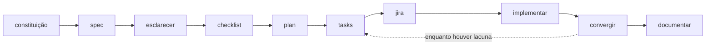

# Spec-Driven Development — guia completo

Este guia explica **como criar uma nova funcionalidade** neste monorepo seguindo spec-driven development (SDD). O fluxo tem 7 fases (mais a constituição e as sub-fases de esclarecimento, checklist e análise), e cada fase produz um artefato com um **gate de saída** que precisa ser satisfeito antes de avançar.

A ideia central não muda: a solução é especificada e validada **antes** de qualquer código ser escrito, e a spec (junto do plan e das tasks) vira a fonte da verdade para Jira, implementação, documentação e PR.

## Por que spec-driven?

Sem uma spec, o alinhamento sobre "o que construir" acontece implicitamente durante a implementação ou, pior, só na revisão do PR — quando mudar de rumo já é caro. Com spec-driven:

- **Alinhamento acontece antes do código**, quando ainda é barato mudar de ideia.
- A spec vira **checklist de aceite** — dá pra saber quando a feature está pronta.
- Jira, feature doc e PR deixam de ser redigidos "do zero" e passam a **referenciar** spec, plan e tasks, evitando retrabalho e divergência entre os documentos.
- **TDD é obrigatório (R12)**: os critérios de aceite da spec viram testes primeiro (Red), a implementação só os faz passar (Green), e então refatora (Refactor). Nada é implementado sem um teste falhando primeiro.
- A **constituição** (fase 0) define os princípios MUST que o analyze (fase 3b) usa para julgar se o plano está correto — o rigor do processo não depende de memória de quem toca o fluxo.

## Visão geral do fluxo


```mermaid
flowchart LR
  A["constituição"] --> B["spec"]
  B --> C["esclarecer"]
  C --> D["checklist"]
  D --> E["plan"]
  E --> F["tasks"]
  F --> G["jira"]
  G --> H["implementar"]
  H --> I["convergir"]
  I --> J["documentar"]
  I -. "enquanto houver lacuna" .-> F
```

Todos os arquivos de uma mesma feature compartilham o **mesmo `<slug>`** em kebab-case com prefixo de data (`YYYY-MM-DD-<nome>`), o que permite navegar entre spec → plan → tasks → jira → feature → PR sem ambiguidade.

| Fase | Artefato | Agente dono | Gate de saída |
|:---|:---|:---|:---|
| 0 Constituição | `agent-memory: projetos/svelte-app-clean-arch/constituicao.md`, injetada no bloco AGENT-MEMORY do `AGENTS.md` | usuário | — |
| 1 Spec (o QUÊ) | `docs/specs/<slug>.md` | `spec-creator` | ≤3 marcadores `[PRECISA ESCLARECER]` |
| 1b Esclarecer | edita `docs/specs/<slug>.md` seção `## Esclarecimentos` | `spec-creator` | cota de 5 perguntas ou ambiguidades críticas resolvidas |
| 1c Checklist | `docs/specs/<slug>.checklist.md` | `spec-reviewer` | itens `CHK###` gerados (marcação `[x]` é do humano) |
| 2 Plan (o COMO) | `docs/specs/<slug>.plan.md` | `spec-creator` | Constitution Check sem violação injustificada |
| 3 Tasks | `docs/specs/<slug>.tasks.md` | `spec-creator` | toda `RF-###` coberta por ≥1 `T###` |
| 3b Analyze | relatório em tela (read-only) | `spec-reviewer` modo analyze | nenhum achado CRITICAL |
| 4 Jira | `docs/workflow/<slug>.jira.md` (**derivado** de `.tasks.md`) | `spec-creator` | — |
| 5 Implementar | código, TDD Red-Green-Refactor | `frontend`/`backend`/`test-writer` | todas as tasks `[X]`, `pnpm test` verde |
| 6 Convergir | **append** em `docs/specs/<slug>.tasks.md` | `spec-converge` | `✅ Convergido` |
| 7 Documentar | `docs/features/<slug>.md` + `docs/CHANGELOG.md` + `docs/workflow/<slug>.pr.md` | `docs-writer` | — |
| Bug | `docs/bugs/<slug>.assessment.md` → `.fix.md` → `.test.md` | `bug-assess` → `frontend`/`backend` → `test-writer` | veredito `verificado` |

## Spec é o quê, plan é o como

A fase 1 descreve **o QUÊ e o PORQUÊ**; a fase 2 descreve **o COMO**. Essa separação é a regra **R1** e existe por um motivo concreto de manutenção: uma spec amarrada à stack apodrece junto do código. Quando a spec nomeia framework, rota ou componente, qualquer refactor de implementação invalida o documento de intenção — e aí ou a spec vira mentira, ou as pessoas passam a ignorá-la.

Proibido na spec (`docs/specs/<slug>.md`): nome de framework, biblioteca, arquivo, rota, coleção, campo de banco, componente. Tudo isso vive no `.plan.md`. Única exceção: nomear um sistema externo já em produção quando o requisito é de compatibilidade.

Este próprio guia é o exemplo histórico do defeito: a versão anterior ensinava, na seção de implementação, o padrão morto `UI → Container → Service → Gateway → API → Store` (com gateways em memória), enquanto o [`docs/specs/_template.md`](./specs/_template.md) já o declarava resquício. A contradição entre os dois documentos é exatamente o tipo de apodrecimento que a separação QUÊ/COMO impede — se a spec só fala do QUÊ, ela não fica obsoleta quando a stack muda, e o COMO (que muda) fica isolado no plan.

## Ambiguidade e premissas

Regra **R2**: marque `[PRECISA ESCLARECER: pergunta]`, com **máximo 3 por spec**. Se existe um default óbvio da indústria ou do projeto, **assuma o default** e registre em `## Premissas` em vez de perguntar — pergunta só vale quando a resposta muda de fato o comportamento.

Mais de 3 marcadores `[PRECISA ESCLARECER]` é o sinal de que a feature é grande demais para uma única spec: use `.roadmap.md` (ver [Épicos grandes](#épicos-grandes)) em vez de estourar o teto.

## Esclarecimento com cota

Regra **R3**: quando a spec termina com ambiguidades, o `spec-creator` conduz uma sessão de esclarecimento disciplinada — não um interrogatório aberto.

A varredura percorre **10 categorias**, cada uma marcada `Claro | Parcial | Ausente`:

1. Escopo & comportamento
2. Domínio & dados
3. Fluxo de UX
4. Atributos não-funcionais
5. Integrações & dependências
6. Casos de borda
7. Restrições & trade-offs
8. Terminologia
9. Sinais de conclusão
10. Placeholders

As dúvidas entram numa fila ordenada por `Impacto × Incerteza` — primeiro o que é ao mesmo tempo mais consequente e menos claro.

**Máximo 5 perguntas na sessão**, EXATAMENTE uma por vez, nunca antecipando a próxima. Cada pergunta traz "Por que importa" + 2 a 5 opções. Após CADA resposta:

- gravar `- Q: … → A: …` em `## Esclarecimentos` / `### Sessão AAAA-MM-DD`;
- atualizar a seção temática correspondente da spec;
- **salvar o arquivo antes da próxima pergunta** (uma resposta perdida é uma decisão perdida).

O que sobrar da cota vira `Deferred:` listado na própria seção `## Esclarecimentos`, para não sumir do radar.

Por que cota e log: sem teto, o esclarecimento vira uma conversa infinita que adia a entrega; sem log, as respostas ficam na memória de quem perguntou e o resto do time precisa re-perguntar. A cota força priorização (só o que `Impacto × Incerteza` justifica gasta pergunta), e o log transforma decisão oral em registro escrito.

## Rastreabilidade

Regra **R4**: IDs estáveis de largura fixa — `RF-001`, `RNF-001`, `AC-001`, `SC-001`, `CHK001`, `T001`, `US1` (user story), `R1` (entrada de roadmap). IDs **nunca são renumerados nem reciclados** depois de referenciados: se o `T003` é removido, o próximo continua sendo `T004`, porque um ID já citado em Jira, PR ou conversa não pode mudar de significado.

A regra requisito↔task é o fio condutor do fluxo: **toda `RF-###` coberta por ≥1 `T###`**. É ela que garante que nada especificado fique sem dono na implementação.

O analyze (fase 3b, read-only) usa severidades objetivas (**R7**), com teto de 50 achados:

- **CRITICAL** — viola princípio MUST da constituição OU requisito com zero cobertura em `.tasks.md`;
- **ALTA** — requisito duplicado/conflitante ou critério de aceite não testável;
- **MÉDIA** — drift de terminologia, caso de borda vago;
- **BAIXA** — estilo.

Modo read-only: a correção é sempre feita no artefato dono, nunca no relatório. O analyze bloqueia a ida para o Jira enquanto houver achado CRITICAL.

## Checklist é do revisor

Regra **R6**: o checklist (`docs/specs/<slug>.checklist.md`, fase 1c) é produzido pelo `spec-reviewer` e contém itens `CHK###` interrogativos sobre a **redação do requisito**, não sobre o software.

Proibidos os verbos "Verificar", "Testar", "Confirmar", "clicar", "funciona corretamente". Padrão bom: "Os critérios de aceite estão definidos para o cenário de permissão negada?", "O termo vago 'rápido' está quantificado?".

O agente **nunca** marca `[x]` — a marcação é do humano. Quem implementa lê o checklist como gate e **não** altera marcadores. Por que separar revisor de implementador: quem escreveu a spec tem ponto cego sobre as próprias suposições; um par interrogando a redação pega a ambiguidade antes que ela vire código errado.

## Implementar com TDD

A fase 5 segue o padrão real do app ativo `apps/runes` (ver [`.cursor/rules/architecture/runes-ports-adapters.mdc`](../.cursor/rules/architecture/runes-ports-adapters.mdc)):

- **Ações de servidor**: form actions em `+page.server.ts` chamando `locals.pb` — sem camadas intermediárias de `Container`/`Service`/`Gateway`.
- **Domínio puro**: classes reativas `.svelte.ts` em `apps/runes/src/lib/domain/` (usadas para realtime), sem acesso a banco, rede ou SvelteKit.
- **Validação**: schemas Zod em `apps/runes/src/lib/validation/`.
- **Tipos**: `*Record.ts` em `apps/runes/src/lib/server/` tipam as coleções/registros do PocketBase.

**TDD é MUST (R12)**: nenhuma linha de código de produção sem o teste que a exige. Cada task de `.tasks.md` segue o ciclo Red-Green-Refactor:

1. **Red** — escreva o teste que cobre o AC (deve falhar porque a implementação não existe). Para domínio puro, use mocks diretos; para variações de permissão, testes de herança com `describe.each`.
2. **Green** — implemente o mínimo necessário para o teste passar. Nada além do que o teste pede.
3. **Refactor** — ajuste o design sem quebrar os testes. Só então passe para a próxima task.

Regras do processo:

- Testes de domínio (`apps/runes/src/lib/domain/`) são puros — sem acesso a banco, rede ou SvelteKit.
- Testes de validação (`apps/runes/src/lib/validation/`) cobrem schemas Zod com casos válidos e inválidos.
- Testes E2E (`apps/runes/e2e/`) cobrem o fluxo completo renderizado, mas vêm depois da implementação do domínio — não substituem os testes unitários.
- O gate da fase é **todas as tasks `[X]` e `pnpm test` verde**.

## Convergência

Regra **R8**: a convergência é **append-only**. Nunca edita nem apaga código; nunca reescreve tasks existentes. Cada achado é classificado num dos **4 tipos de lacuna**:

- `ausente` — a implementação não cobre algo da spec/plan;
- `parcial` — cobre pela metade;
- `contradiz` — o código diverge do que foi especificado;
- `não-solicitado` — código além do escopo (precisa justificar ou virar débito).

Violação de constituição é emitida **primeiro e sempre como CRITICAL**. O próximo id é `T{M+1:03d}` (nunca renumera). Saída: `✅ Convergido` ou `↻ N tarefas anexadas` em nova seção `## Fase N: Convergência`.

O loop **implementar ↔ convergir** se repete **enquanto houver lacuna**: cada achado vira uma task anexada, a implementação a resolve, e a convergência roda de novo. **A feature não está pronta antes do `✅ Convergido`** — uma spec com tasks `[X]` mas sem convergência ainda pode ter implementação que contradiz o que foi aprovado.

## Como as specs envelhecem

Regime **flow-forward** (R10): a spec aprovada é registro histórico. Mudança de rumo = **nova spec** com `Supersede: docs/specs/<antiga>.md`, e a antiga recebe `Status: superada por <nova>`. É proibido reescrever spec aprovada para caber no que foi implementado.

Consequência prática: **não edite a spec durante a implementação**. Se surgir algo fora do que foi especificado, registre o achado na convergência (que o classifica como `ausente`/`contradiz` e anexa uma task) ou, se for de fato uma mudança de rumo, abra uma **nova spec via supersede**. Editar a spec em silêncio apaga o registro do que foi decidido e torna impossível auditar por que o código divergiu.

## Épicos grandes

Quando a feature é grande demais para uma única spec — em especial, mais de 3 marcadores `[PRECISA ESCLARECER]` (R2) — quebre em `<epico>.roadmap.md`. Cada entrada `R1`, `R2`, … do roadmap vira uma spec própria (`docs/specs/<slug>.md`), cada uma com seu plan, tasks e convergência. O roadmap mantém a visão do todo sem estourar os tetos de ambiguidade de uma spec individual.

## Bugs

Bug não passa pelo fluxo de spec: use a pasta `docs/bugs/` e o fluxo de veredito (**R9**):

- `assess` é **read-only** e escreve só o `.assessment.md`;
- `fix` fica **confinado aos arquivos listados no assessment**; ampliar escopo exige seção `## Desvios do Assessment`;
- `test` emite `verificado | parcial | falhou` e **rebaixa obrigatoriamente para `parcial` se a reprodução documentada não foi de fato executada**.

Só o veredito `verificado` autoriza registro em `erros/` da memória central; `parcial`/`falhou` vão para `debitos-tecnicos/`.

## Memória central

Regra **R11**: passo 0 de toda fase é consultar a memória central. Antes de tocar um arquivo ou resolver um problema, rode:

```bash
python3 ~/projects/agent-memory/scripts/memory.py code <caminho>
python3 ~/projects/agent-memory/scripts/memory.py symptom "<erro literal>"
python3 ~/projects/agent-memory/scripts/memory.py solve "<problema>"
```

Achados vão para `## Memória aplicável` do `.plan.md`. Ao concluir, registre o novo conhecimento na memória central com `evidence` + `source_refs` — decisão sem procedência não entra.

## Quando pular a spec

Nem toda mudança precisa da fase 1. Pule a spec quando:

- For um **bugfix trivial** de poucas linhas, sem impacto de design — nesse caso vá para o **fluxo de bug** (`docs/bugs/`), não "direto para o Jira";
- A mudança for **mecânica**, sem ambiguidade sobre o que fazer.

Escreva a spec quando:

- A funcionalidade envolve mais de uma camada (domínio + API + UI);
- Há mais de uma forma razoável de resolver o problema;
- O critério de "pronto" não é óbvio sem discussão prévia.

## Referências

- Regra Cursor: [`.cursor/rules/workflow/spec-driven.mdc`](../.cursor/rules/workflow/spec-driven.mdc)
- Regra Cursor (Jira): [`.cursor/rules/workflow/jira-tasks.mdc`](../.cursor/rules/workflow/jira-tasks.mdc)
- Regra Cursor (PR): [`.cursor/rules/workflow/pr-description.mdc`](../.cursor/rules/workflow/pr-description.mdc)
- Regra Cursor (arquitetura): [`.cursor/rules/architecture/runes-ports-adapters.mdc`](../.cursor/rules/architecture/runes-ports-adapters.mdc)
- Regra Cursor (doc de feature): [`.cursor/rules/documentation/feature-documentation.mdc`](../.cursor/rules/documentation/feature-documentation.mdc)
- Índice geral: [`docs/README.md`](./README.md)
- [`CLAUDE.md`](../CLAUDE.md) na raiz do repositório
