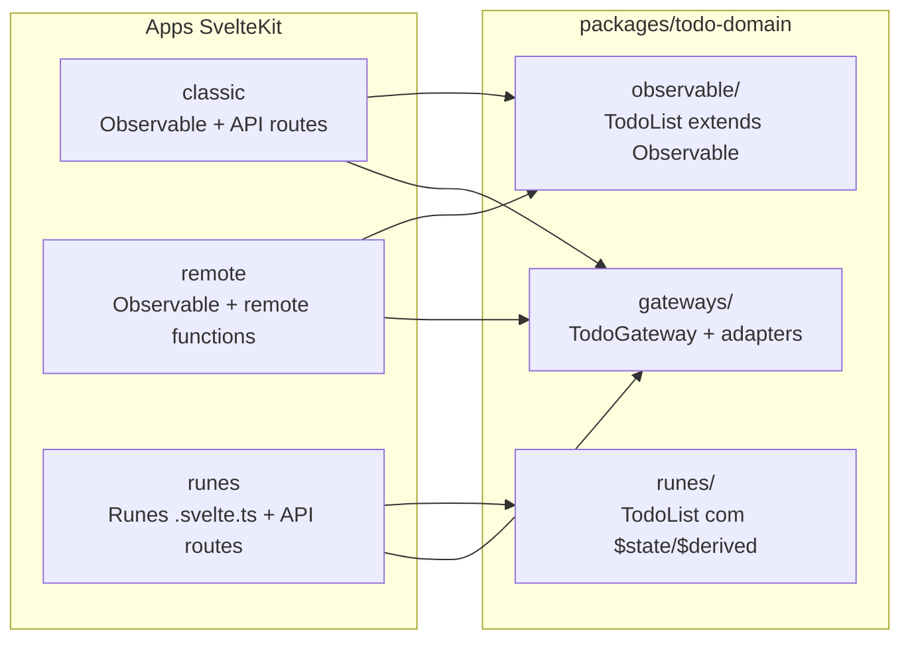

# SvelteKit Todo App — Ports & Adapters (Classic + Remote + Runes)

## Confirmação sobre Observable

**Sim, o padrão Observable foi removido na iteração anterior.** Este plano **restaura** `Observable.ts` e `Observer.ts` fielmente ao código de referência, usados nos apps `classic` e `remote`. O app `runes` é a **terceira variante**, usando runes do Svelte 5 em classes `.svelte.ts`.

---

## Contexto do código de referência

O projeto em [`ports_and_adapters_ca_design_patterns_frontend-master`](ports_and_adapters_ca_design_patterns_frontend-master) implementa:

- **Domínio**: `TodoList extends Observable`, `Item`, padrão **Observer/Observable** para sincronizar domínio → gateway
- **Porta**: interface `TodoGateway`
- **Adaptadores**: `TodoMemoryGateway` (testes) e `TodoHttpGateway` (API HTTP)
- **UI**: `TodoListComponent` (apresentação) + `TodoListView` (carrega gateway, registra observers)
- **Backend Express** → substituído pelo server-side do SvelteKit

---

## Três apps — o que cada um demonstra



| App | Padrão de domínio | Comunicação server | Equivalente ao original |
|---|---|---|---|
| `apps/classic` | **Observable/Observer** | REST `/api/todos` | Sim — ports & adapters clássico |
| `apps/remote` | **Observable/Observer** | Remote functions | Sim — mesmo domínio, transporte diferente |
| `apps/runes` | **Runes em `.svelte.ts`** | REST `/api/todos` | Variante moderna Svelte 5 |

---

## Estrutura do monorepo

```
svelte-app/
├── package.json
├── packages/
│   └── todo-domain/
│       ├── src/
│       │   ├── observable/              # fiel ao original (.ts puro)
│       │   │   ├── Observable.ts
│       │   │   ├── Observer.ts
│       │   │   ├── Item.ts
│       │   │   └── TodoList.ts          # extends Observable, notify() nos métodos
│       │   ├── runes/                   # variante Svelte 5 (.svelte.ts)
│       │   │   ├── Item.svelte.ts       # $state
│       │   │   ├── TodoList.svelte.ts   # $state + $derived
│       │   │   └── TodoListService.svelte.ts
│       │   ├── gateways/                # compartilhados (.ts)
│       │   │   ├── TodoGateway.ts
│       │   │   ├── TodoMemoryGateway.ts
│       │   │   ├── TodoHttpGateway.ts
│       │   │   └── TodoRemoteGateway.ts
│       │   ├── types.ts                 # TodoItemDTO
│       │   └── index.ts
│       ├── vitest.config.ts
│       └── test/
│           ├── observable/TodoList.test.ts
│           ├── runes/TodoList.test.ts
│           └── runes/TodoListService.test.ts
└── apps/
    ├── classic/     # Observable + API routes
    ├── remote/      # Observable + remote functions
    └── runes/       # Runes + API routes
```

**Gerenciador**: npm workspaces.

**Scaffold**: `npx sv create` × 3, template minimal, TypeScript, Vitest, Svelte 5.

---

## Pacote compartilhado `packages/todo-domain`

### Gateways compartilhados (`.ts` — ports & adapters)

Interface baseada em **DTOs** para ser agnóstica ao tipo de domínio:

```typescript
// TodoGateway.ts
export interface TodoGateway {
  getTodos(): Promise<TodoItemDTO[]>;
  addItem(item: TodoItemDTO): Promise<void>;
  updateItem(item: TodoItemDTO): Promise<void>;
  removeItem(id: string): Promise<void>;
}
```

| Adaptador | Uso |
|---|---|
| `TodoMemoryGateway` | Testes — store in-memory interno |
| `TodoHttpGateway` | classic + runes — fetch para `/api/todos` |
| `TodoRemoteGateway` | remote — delega para `.remote.ts` |

---

### Domínio Observable (`.ts` — restaurado do original)

Portado fielmente de [`ports_and_adapters_ca_design_patterns_frontend-master/frontend/src/entities/`](ports_and_adapters_ca_design_patterns_frontend-master/frontend/src/entities/):

**[`Observable.ts`](packages/todo-domain/src/observable/Observable.ts)** e **[`Observer.ts`](packages/todo-domain/src/observable/Observer.ts)** — inalterados em conceito.

**[`TodoList.ts`](packages/todo-domain/src/observable/TodoList.ts)** — `extends Observable`:

```typescript
export default class TodoList extends Observable {
  items: Item[];

  async addItem(description: string) {
    // regras de negócio...
    this.notify('addItem', item);
  }
  async removeItem(item: Item) { this.notify('removeItem', item); }
  async toggleDone(item: Item) { this.notify('toggleDone', item); }
  getCompleted(): number { /* percentual arredondado */ }
}
```

**Fluxo original preservado** (equivalente a `TodoListView.vue`):

```
onMount → gateway.getTodos() → TodoList.fromDTO()
       → register Observer('addItem',  () => gateway.addItem(item))
       → register Observer('removeItem', () => gateway.removeItem(id))
       → register Observer('toggleDone', () => gateway.updateItem(item))
       → user action → TodoList.notify → Observer → gateway
```

**Ponte Svelte ↔ Observable**: como `TodoList` muta `items` in-place (sem runes), o container usa `$state` para segurar a referência e um callback `onNotify` registrado via observer adicional (ou reassign `todoList = todoList`) para forçar re-render do Svelte:

```svelte
<!-- TodoListContainer.svelte (classic/remote) -->
<script lang="ts">
  let todoList = $state<TodoList>(new TodoList());
  let revision = $state(0);
  const bump = () => { revision++; };

  onMount(async () => {
    const list = TodoList.fromDTO(await gateway.getTodos());
    list.register(new Observer('addItem',  async (item) => { await gateway.addItem(item.toDTO()); bump(); }));
    list.register(new Observer('removeItem', async (item) => { await gateway.removeItem(item.id); bump(); }));
    list.register(new Observer('toggleDone', async (item) => { await gateway.updateItem(item.toDTO()); bump(); }));
    todoList = list;
  });
</script>
<!-- revision lido no template garante reatividade -->
<span class="completed">{todoList.getCompleted()}%</span>
```

---

### Domínio Runes (`.svelte.ts` — app runes exclusivo)

**[`Item.svelte.ts`](packages/todo-domain/src/runes/Item.svelte.ts)**:

```typescript
export class Item {
  id = $state<string>('');
  description = $state<string>('');
  done = $state<boolean>(false);
}
```

**[`TodoList.svelte.ts`](packages/todo-domain/src/runes/TodoList.svelte.ts)**:

```typescript
export class TodoList {
  items = $state<Item[]>([]);
  completedPercent = $derived.by(() => { /* mesma lógica de getCompleted() */ });
  // addItem, removeItem, toggleDone — sem notify(), reatividade nativa
}
```

**[`TodoListService.svelte.ts`](packages/todo-domain/src/runes/TodoListService.svelte.ts)** — substitui Observer pattern:

```typescript
export class TodoListService {
  #list = $state<TodoList>(new TodoList());
  get list() { return this.#list; }

  constructor(private gateway: TodoGateway) {}

  async load() { this.#list = TodoList.fromDTO(await this.gateway.getTodos()); }
  async addItem(description: string) {
    this.#list.addItem(description);
    const item = this.#list.getItem(description);
    if (item) await this.gateway.addItem(item.toDTO());
  }
  // removeItem, toggleDone — domínio primeiro, gateway depois
}
```

**Regra**: `$effect` para side-effects fica **apenas em componentes `.svelte`**, nunca dentro de classes.

---

## Store server-side (por app)

Cada app tem [`src/lib/server/todoStore.ts`](apps/classic/src/lib/server/todoStore.ts) — idêntico, `.ts` puro:

```typescript
export function getTodos(): TodoItemDTO[] { ... }
export function addTodo(item: TodoItemDTO): void { ... }
export function updateTodo(id: string, done: boolean): void { ... }
export function removeTodo(id: string): void { ... }
export function resetStore(): void { ... } // testes
```

---

## App 1: `apps/classic` — Observable + API routes

### Server
- `src/routes/api/todos/+server.ts` — GET, POST
- `src/routes/api/todos/[id]/+server.ts` — PUT, DELETE

### UI
- [`TodoList.svelte`](apps/classic/src/lib/components/TodoList.svelte) — apresentação (recebe `todoList` + handlers)
- [`TodoListContainer.svelte`](apps/classic/src/lib/components/TodoListContainer.svelte) — carrega gateway, registra **Observers**, ponte `$state`/`revision`
- Gateway: `TodoHttpGateway(fetch, '')`

### Testes
- Domínio: `packages/todo-domain/test/observable/TodoList.test.ts` (portado do original)
- Integração: `@testing-library/svelte` + `TodoMemoryGateway` (equivalente a `TodoListView.test.ts` — espera 33%)

---

## App 2: `apps/remote` — Observable + remote functions

### Config experimental
```javascript
// svelte.config.js
kit: { experimental: { remoteFunctions: true } },
compilerOptions: { experimental: { async: true } }
```

### Server
- [`src/routes/todos.remote.ts`](apps/remote/src/routes/todos.remote.ts) — `query` + `command` com Valibot

### UI
- Mesmos componentes Observable de `classic`
- Gateway: `TodoRemoteGateway` (injeta funções remote)

### Testes
- Domínio observable compartilhado
- `TodoRemoteGateway` com mocks
- Remote functions server-side + `resetStore()`

---

## App 3: `apps/runes` — Runes + API routes

### Server
- Mesmas API routes de `classic` (`/api/todos`)

### UI
- [`TodoList.svelte`](apps/runes/src/lib/components/TodoList.svelte) — recebe `TodoListService`, lê `service.list.completedPercent` (reativo via `$derived`)
- [`TodoListContainer.svelte`](apps/runes/src/lib/components/TodoListContainer.svelte):

```svelte
<script lang="ts">
  const gateway = new TodoHttpGateway(fetch, '');
  const service = new TodoListService(gateway);
  $effect(() => { service.load(); });
</script>
<TodoList {service} />
```

### Testes
- `packages/todo-domain/test/runes/TodoList.test.ts`
- `packages/todo-domain/test/runes/TodoListService.test.ts`
- Componente com `TodoMemoryGateway`

---

## Comparação das três versões

| Aspecto | classic | remote | runes |
|---|---|---|---|
| Domínio | Observable/Observer (`.ts`) | Observable/Observer (`.ts`) | Runes (`.svelte.ts`) |
| Sincronização gateway | `notify()` → Observer | `notify()` → Observer | `TodoListService` métodos async |
| Comunicação server | REST `/api/todos` | remote functions | REST `/api/todos` |
| Reatividade UI | ponte `$state` + `revision` | idêntico | nativa via `$state`/`$derived` |
| Testabilidade | `TodoMemoryGateway` | `TodoMemoryGateway` / mock remote | `TodoMemoryGateway` |
| Fidelidade ao original | alta | alta (só muda transporte) | adaptação Svelte 5 |

---

## Comandos de setup (execução)

```bash
npm init -w apps/classic -w apps/remote -w apps/runes -w packages/todo-domain

npx sv create apps/classic --template minimal --types ts --add vitest --no-install
npx sv create apps/remote --template minimal --types ts --add vitest --no-install
npx sv create apps/runes  --template minimal --types ts --add vitest --no-install

npm install
npm run test -w packages/todo-domain
npm run dev -w apps/classic   # :5173
npm run dev -w apps/remote    # :5174
npm run dev -w apps/runes     # :5175
```

---

## Arquivos principais a criar

**Pacote domain** (~14 arquivos + testes):
- `observable/`: Observable, Observer, Item, TodoList
- `runes/`: Item.svelte.ts, TodoList.svelte.ts, TodoListService.svelte.ts
- `gateways/`: 4 adaptadores + types

**apps/classic** (~10 arquivos): API routes, componentes Observable, todoStore, tests

**apps/remote** (~12 arquivos): remote functions, componentes Observable, todoStore, tests

**apps/runes** (~10 arquivos): API routes, componentes Runes, todoStore, tests

**Raiz**: `package.json` workspaces, README comparando as 3 abordagens
